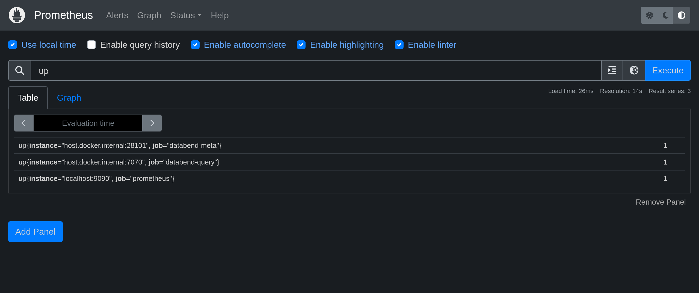
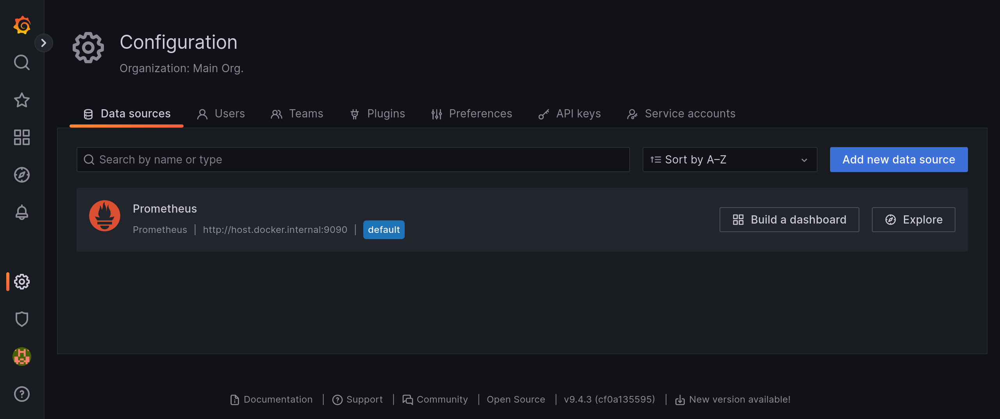
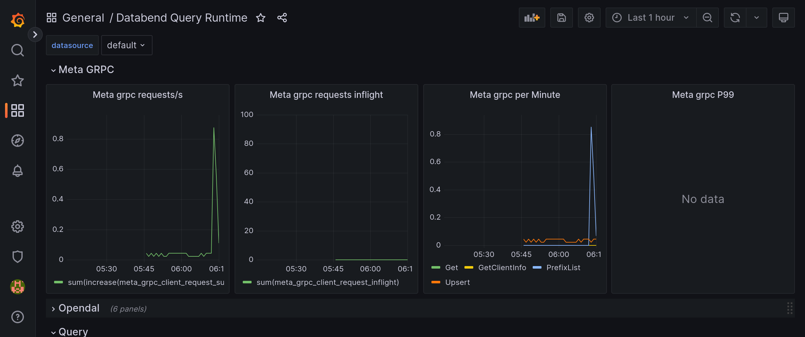

[Prometheus](https://prometheus.io/) is a time series database that features a flexible query language and a multi-dimensional data model.

[Grafana](https://grafana.com/grafana) is an open-source tool used for analyzing and visualizing metrics.

Databend supports using Prometheus to store monitoring and performance metrics, which can be visualized through Grafana.

## Tutorial: Monitor Databend with Prometheus & Grafana

### Step 1. Deploy Databend

Follow the [Deployment Guide](https://databend.rs/doc/deploy) to deploy Databend.

In this example, we use the default configuration located in the `configs` directory of release to deploy a standalone  Databend. You can also find these configurations at [datafuselabs/databend - configs](https://github.com/datafuselabs/databend/tree/main/scripts/distribution/configs).

Therefore, the metrics API for databend-meta is `0.0.0.0:28101/v1/metrics`, while the metrics API for databend-query is `0.0.0.0:7070/metrics`.

### Step 2. Deploy Prometheus

Please refer [Prometheus Installation](https://prometheus.io/docs/prometheus/latest/installation/). For convenience, Docker images are used in this tutorial.

1. Pull Prometheus' Docker Image

    ```bash
    docker pull prom/prometheus
    ```

2. Edit Prometheus' configuration

    We use [prometheus/prometheus - prometheus.yml](https://github.com/prometheus/prometheus/blob/main/documentation/examples/prometheus.yml) as the base configuration and add the necessary configurations for scraping Databend's metrics.

    ```yaml
      - job_name: "databend-query"

        # metrics_path defaults to '/metrics'
        # scheme defaults to 'http'.

        static_configs:
          - targets: ["0.0.0.0:7070"]

      - job_name: "databend-meta"

        metrics_path: '/v1/metrics'
        # scheme defaults to 'http'.

        static_configs:
          - targets: ["0.0.0.0:28101"]
    ```

3. Deploy Prometheus

    For convenience, the host machine network is used here. Please modify it according to actual situation.

    ```bash
    docker run \
    --network host \
    -v /path/to/prometheus.yml:/etc/prometheus/prometheus.yml \
    prom/prometheus
    ```

4. Check Metrics Status

    Execute `up` in Prometheus UI (default `http://0.0.0.0:9090`). `1` represents normal, `0` represents abnormal.

    

### Step 3. Deploy Grafana

Please refer [Grafana Installation](https://grafana.com/docs/grafana/latest/setup-grafana/installation/). For convenience, Docker images are used in this tutorial.

1. Pull Grafana's Docker Image

    ```bash
    docker pull grafana/grafana
    ```

2. Deploy Grafana

    For convenience, the host machine network is used here. Please modify it according to actual situation.

    ```bash
    docker run \
    --network host \
    grafana/grafana
    ```

3. Add DataSource

    Access Grafana's web page (default `http://0.0.0.0:3000`), the username and default password are both `admin`.

    We need to add a `Prometheus` type data source by selecting `Configuration → Data Sources → Add data source`.

    

4. Configure Grafana Dashboard

    We recommend using the JSON files in [datafuselabs/helm-charts - dashboards](https://github.com/datafuselabs/helm-charts/tree/main/dashboards) to configure the Grafana dashboard, or customize it according to your own needs.

    Please visit `http://0.0.0.0:3000/dashboard/import` and upload the corresponding JSON file. Then, select the `Prometheus` data source.

    

5. View Grafana Dashboard

    Based on the `UID`, we can access the corresponding dashboard. In this example, the address we want to access is: `http://0.0.0.0:3000/d/cxu72qHVa/`.

    
