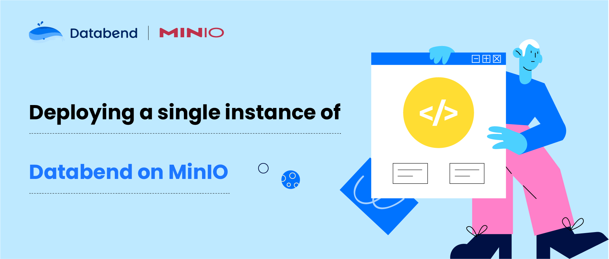
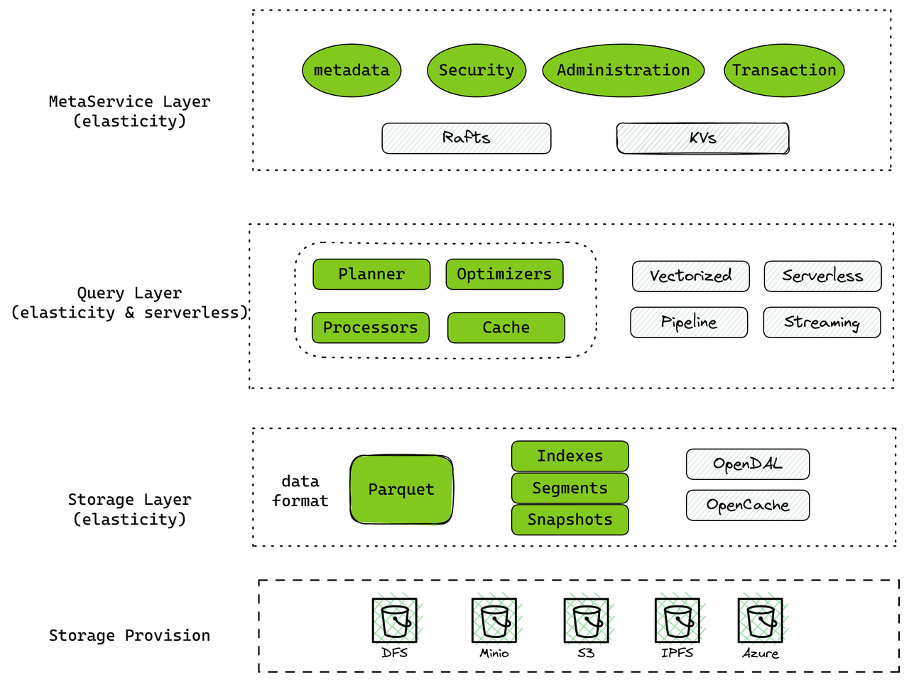

In this article, we will discuss how to deploy a single instance of Databend using MinIO for facilitating data analysis. MinIO is an object storage solution that is lightweight and easy to operate. Databend is a modern data warehouse designed for cloud architecture, built with Rust and open-source. It provides rapid elastic scaling and aims to create an on-demand, pay-as-you-go data cloud product experience.

Open-Source Repo: https://github.com/datafuselabs/databend/

Databend Docs: https://databend.rs

## Databend Architecture



Databend is architecturally divided into three layers: Meta Service Layer, Query Layer, and Storage Layer.

- Meta Service Layer

This layer stores permission definitions, table structure definitions, transaction management, table and data association, and the overall logic of data sharing. Cluster deployment is recommended for a production environment.

- Query layer

This layer interacts directly with users and their storage. They interact with Databend through SQL, and the Query Layer reads from and and writes to the storage layer after receiving their requests. This layer is not always online and can be pulled up when needed. Scale up and down are allowed in this layer.

- Storage Layer

The Databend storage layer is the Databend Fuse Engine and supports for cloud and self-built object storage. Databend uses the Parquet format to store data block with min/max indexing, sparse indexing, bloom indexing, etc.


### Databend Supported Deployment Platforms

| Platform    | Supported|
| ----------- | -------- |
| AWS S3      | Yes     |
| Google GCS  | Yes     |
| Azure Blob  | Yes     |
| Aliyun OSS  | Yes     |
| Tencent COS | Yes     |
| Huawei OBS  | Yes     |
| MinIO       | Yes     |
| Ceph        | Yes     |
| Wasabi      | Yes     |
| SeaweedFS   | Yes     |
| QingStor    | Yes     |

Detailed reference: https://databend.rs/doc/deploy/deploying-databend

## Deploying a Single Instance of Databend

> Compared to the Databend deployment, a MinIO environment is easier to set up. In a production environment, MinIO Cloud or AWS S3 environment is recommended for a hassle-free experience.

The following uses the MinIO + Databend standalone deployment in Linux of x64 as an example:

| Software | Path           | Port                                                |
| -------- | -------------- | --------------------------------------------------- |
| minio    | /data/minio    | 9900                                                |
| databend | /data/databend | mysql: 3307 <br/> http:  8000 <br/>Clickhouse http:  8124 |

### Minio Deployment

MinIO Homepage: https://min.io/

Download MinIO from the official website and start it by running the following commands:

```Bash
cd /data 
mkdir minio
cd minio 
wget https://dl.min.io/server/minio/release/linux-amd64/minio
export MINIO_ROOT_USER=minioadmin
export MINIO_ROOT_PASSWORD=minioadmin
./minio server ./data./minio server --address :9900 ./data
```
Use the MinIO Admin web interface to create a bucket named as "databend":


After creating the bucket, the MinIO deployment is complete.

### Download and Install Databend

| Type                                                         | OS            |
| ------------------------------------------------------------ | ------------- |
| - databend-version-nightly-x86_64-unknown-linux-musl.tar.gz  | Linux for x64 |
| - databend-version-nightly-aarch64-apple-darwin.tar.gz       | MacOS of M1   |
| - databend-version-nightly-aarch64-unknown-linux-musl.tar.gz | Linux of Arm  |
| - databend-version-nightly-x86_64-apple-darwin.tar.gz        | MacOS of X64  |
| - source code                                                | src           |

We can download the musl package for Linux from the Databend open-source project repo: https://github.com/datafuselabs/databend/tags

The latest version is always recommended as Databend develops and merges new features on a daily basis. For example, if you're running Linux on an x86_64 machine, you can download version v0.9.51-nightly like this:

```Bash
cd /data
mkdir databend
export ver=v0.9.51-nightly
wget https://repo.databend.rs/databend/$ver/databend-$ver-x86_64-unknown-linux-musl.tar.gz
cd databend
tar zxvf ../databend-$ver-x86_64-unknown-linux-musl.tar.gz

sudo mkdir /var/log/databend
sudo mkdir /var/lib/databend
sudo chown -R $USER /var/log/databend
sudo chown -R $USER /var/log/databend
```


The Databend installation files are extracted to a directory named "databend".
### Configure Databend

Once you have installed Databend, you'll need to configure it. The default configuration file for databend-query is included with the download. You can modify this file as follows:

```Bash
vim configs/databend-query.toml
```

change:

```Bash
# Storage config.[storage]
# fs | s3 | azblob | obs
type = "s3"
# Set a local folder to store your data.
# Comment out this block if you're NOT using local file system as storage.
[storage.fs]
data_path = "/var/lib/databend/data"
# To use S3-compatible object storage, uncomment this block and set your values.
[storage.s3]
bucket = "databend"
endpoint_url = "https://127.0.0.1:9900"
access_key_id = "minioadmin"
secret_access_key = "minioadmin"
```

### Start and Stop Databend 

To start Databend, run the following command:

```Bash
./script/start.sh
```

To check that Databend is running, you can use the following command:
```
ps axu |grep databend
```


To stop Databend, run the following command:

```Bash
./script/stop.sh 
```

#### Connect to  Databend

Databend has three external service ports by default: 
 
- MySQL: 3307 supports MySQL cli and application connection. 
- Clickhouse: 8124 Clickhouse http handler protocol 
- [http prot: 8000](https://databend.rs/doc/integrations/api/rest) The Databend HTTP handler is a REST API
 
To connect to Databend using the MySQL client, run the following command:

```Bash
mysql -h 127.0.0.1 -P3307 -uroot
```

>Note that the root user can log in without a password from localhost. Databend permission management refers to the design of MySQL 8.0 and allows you to manage Databend users in the same way as MySQL 8.0 user management. 
 
Clickhouse protocol using: https://databend.rs/doc/reference/api/clickhouse-handler 
 
You're all set up now. Use Databend as you're with MySQL.

## Other Resources
- load data to Databend: https://databend.rs/doc/load-data/
- Databend k8s opterator: https://github.com/datafuselabs/helm-charts
- bendsql:  https://github.com/databendcloud/bendsql 
- Databend driver:
  - Java Driver: https://github.com/databendcloud/databend-jdbc
  - Go  Driver: https://github.com/databendcloud/databend-go
  - Python Driver: https://github.com/databendcloud/databend-py

## Connect With Us

Databend is an open source, flexible, low-cost repository for real-time analysis based on object storage. We look forward to your attention and explore Cloud native Data warehouse solutions together to build a new generation of open source Databend Cloud.

- [Databend Website](https://databend.rs)

- [Databend Cloud](https://databend.com)
  
- [GitHub Discussions](https://github.com/datafuselabs/databend/discussions)

- [Twitter](https://twitter.com/DatabendLabs)

- [Slack Channel](https://link.databend.rs/join-slack)