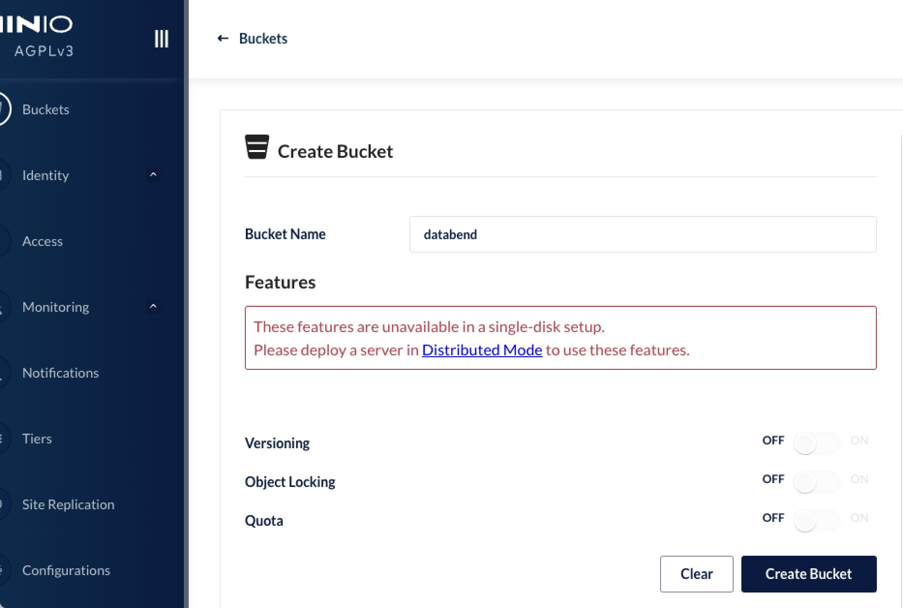

In this article, we will discuss how to deploy a single instance of Databend using MinIO for facilitating data analysis. MinIO is an object storage solution that is lightweight and easy to operate. Databend is a modern data warehouse designed for cloud architecture, built with Rust and open-source. It provides rapid elastic scaling and aims to create an on-demand, pay-as-you-go data cloud product experience.

Open-Soruce Repo: https://github.com/datafuselabs/databend/

Databend Docs: https://databend.rs

## Databend Architecture


Databend is architecturally divided into three layers: Meta Service Layer, Query Layer, and Storage Layer.

- Meta Service Layer

This layer stores permission definitions, table structure definitions, transaction management, table and data association, and the overall logic of data sharing. Cluster deployment is recommended in production.

- Query layer

This layer interacts directly with the user and the storage. The user interacts with Databend through SQL, and the Query Layer reads and writes the storage layer after receiving the user's request. This layer is not online real-time and can be pulled up when in use. It also supports dynamic expansion and contraction.

- Storage Layer

The Databend storage layer is the Databend Fuse Engine and is persisted using object storage in the cloud or self-built object storage. Databend uses the Parquet format on data block storage and implements min/max indexing, sparse indexing, bloom indexing, etc.


### Databend support deployment environments

| Environments| Databend |
| ----------- | -------- |
| AWS S3      | Yes     |
| Google GCS  | Yes     |
| Azure Blob  | Yes     |
| Aliyun OSS  | Yes    |
| Tencent COS | Yes     |
| Huawei OBS  | Yes     |
| MinIO       | Yes     |
| Ceph        | Yes     |
| Wasabi      | Yes     |
| SeaweedFS   | Yes     |
| QingStor    | Yes     |

Detailed reference: https://databend.rs/doc/deploy/deploying-databend

## Databend Single-machine deployment

> In essence, the minio environment is relatively easy to set up. However, if you use in production, you can use the MinIO Cloud or AWS S3 environment to reduce hassle.

The following uses the MinIO + Databend standalone deployment in Linux of x64 as an example:

| Software | path           | port                                                |
| -------- | -------------- | --------------------------------------------------- |
| minio    | /data/minio    | 9900                                                |
| databend | /data/databend | mysql: 3307 <br/> http:  8000 <br/>Clickhouse http:  8124 |

### Minio Deployment

MinIO Homepage: https://min.io/

Download MinIO from the official website and start by running the following commands:

```Bash
cd /data 
mkdir minio
cd minio 
wget https://dl.min.io/server/minio/release/linux-amd64/minio
export MINIO_ROOT_USER=minioadmin
export MINIO_ROOT_PASSWORD=minioadmin
./minio server ./data./minio server --address :9900 ./data
```
Use the MinIO Admin web interface to create a "databend" bucket.



After creating the bucket, the MinIO deployment is complete.

### Download and Install Databend

| type                                                         | os            |
| ------------------------------------------------------------ | ------------- |
| - databend-version-nightly-x86_64-unknown-linux-musl.tar.gz  | Linux for x64 |
| - databend-version-nightly-aarch64-apple-darwin.tar.gz       | MacOS of M1   |
| - databend-version-nightly-aarch64-unknown-linux-musl.tar.gz | Linux of Arm  |
| - databend-version-nightly-x86_64-apple-darwin.tar.gz        | MacOS of X64  |
| - source code                                                | src           |

We can download the musl package for Linux from the Databend open-source project repo a: https://github.com/datafuselabs/databend/tags


Generally, we can download the musl package for Linux. Note the difference between arm and x86_64 platforms.

Download: https://github.com/datafuselabs/databend/tags

For version selection, it is recommended to download the latest version every day. Databend is fast to develop and many new features are merged quickly.For example, if you're running Linux on an x86_64 machine, you can download version v0.9.49 like this:

```Bash
cd /data
mkdir databend
export ver=v0.9.49
wget https://repo.databend.rs/databend/$ver-nightly/databend-$ver-nightly-x86_64-unknown-linux-musl.tar.gz
cd databend
tar zxvf ../databend-$ver-nightly-x86_64-unknown-linux-musl.tar.gz
```


Databend installation files extracted a directory named "databend". 

### Configure Databend

Once you have installed Databend, you'll need to configure it. The default configuration file for databend-query is included with the download. You can modify this file as follows:

```Bash
vim configs/databend-query.toml
```

change:

```Bash
# Storage config.[storage]
# fs | s3 | azblob | obs
type = "s3"
# Set a local folder to store your data.
# Comment out this block if you're NOT using local file system as storage.
[storage.fs]data_path = "./.databend/stateless_test_data"
# To use S3-compatible object storage, uncomment this block and set your values.
[storage.s3]
bucket = "databend"
endpoint_url = "https://127.0.0.1:9900"
access_key_id = "minioadmin"
secret_access_key = "minioadmin"
```

### Start and Stop Databend 

To start Databend, run the following command:

```Bash
./script/start.sh
```

To check that Databend is running, you can use the following command:
```
ps axu |grep databend
```


To stop Databend, run the following command:

```Bash
./script/stop.sh 
```

#### Connect to  Databend

Databend has three external service ports by default: 
 
- MySQL: 3307 supports MySQL cli and application connection. 
- Clickhouse: 8124 Clickhouse http handler protocol 
- [http prot: 8000](https://databend.rs/doc/integrations/api/rest) The Databend HTTP handler is a REST API
 
To connect to Databend using the MySQL client, run the following command:

```Bash
mysql -h 127.0.0.1 -P3307 -uroot
```

Note that root can login without a password using localhost. Databend permission management refers to the design of MySQL 8.0 and allows you to manage Databend users in the same way as MySQL 8.0 user management. 
 
Clickhouse protocol using: https://databend.rs/doc/reference/api/clickhouse-handler 
 
At this point, the Databend deployment is complete. Use can be equivalent to using a MySQL to use the same.

## Other Resources
- Databend k8s opterator: https://github.com/datafuselabs/helm-charts
- bendsql:  https://github.com/databendcloud/bendsql 
- Databend driver:
  - Java Driver: https://github.com/databendcloud/databend-jdbc
  - Go  Driver: https://github.com/databendcloud/databend-go
  - Python Driver: https://github.com/databendcloud/databend-py

## Connect With Us

Databend is an open source, flexible, low-cost repository for real-time analysis based on object storage. We look forward to your attention and explore Cloud native Data warehouse solutions together to build a new generation of open source Databend Cloud.

- [Databend Website](https://databend.rs)

- [Databend Cloud](https://databend.com)
  
- [GitHub Discussions](https://github.com/datafuselabs/databend/discussions)

- [Twitter](https://twitter.com/Datafuse_Labs)

- [Slack Channel](https://link.databend.rs/join-slack)